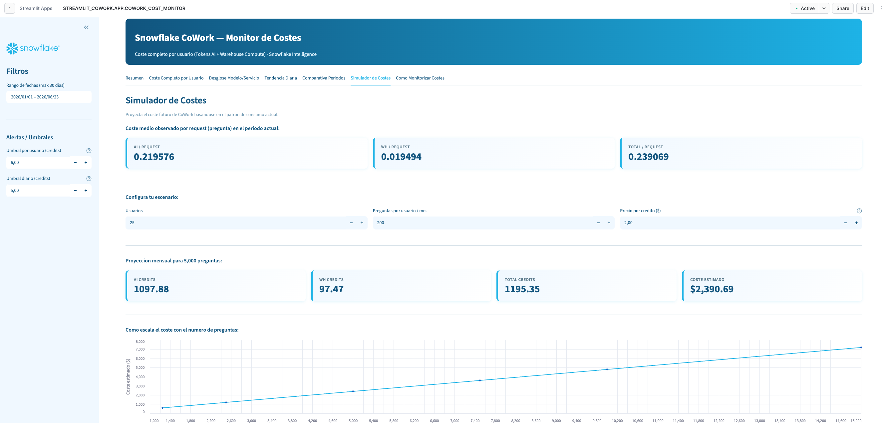
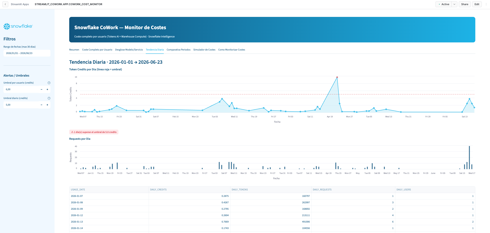

# Snowflake CoWork — Monitor de Costes

Streamlit app para monitorizar de forma completa los costes de **Snowflake CoWork**
(Snowflake Intelligence): combina los **Token Credits (AI)** con los **Warehouse Credits
(compute)** atribuibles a cada usuario, incluso cuando CoWork usa el warehouse del propio
usuario (sin warehouse dedicado).

## Capturas

### Simulador de Costes


### Tendencia Diaria con alertas de umbral


## Que muestra

| Pestana | Contenido |
|---|---|
| **Resumen** | KPIs agregados y top usuarios por token credits |
| **Coste Completo por Usuario** | Token Credits + Warehouse Credits = coste total real por usuario |
| **Desglose Modelo/Servicio** | Creditos por modelo LLM y servicio (cortex_agents, cortex_analyst) |
| **Tendencia Diaria** | Evolucion temporal con alertas de umbral |
| **Comparativa Periodos** | Periodo actual vs anterior con deltas y % cambio |
| **Simulador de Costes** | Proyeccion de coste segun preguntas/mes y precio del credito |
| **Como Monitorizar Costes** | Documentacion de vistas, queries y recomendaciones |

## Como se calcula el coste

```
Coste Total por usuario = Token Credits (AI) + Warehouse Credits (Compute)
```

| Componente | Vista | Columna |
|---|---|---|
| Token Credits | `SNOWFLAKE.ACCOUNT_USAGE.SNOWFLAKE_INTELLIGENCE_USAGE_HISTORY` | `TOKEN_CREDITS` |
| Warehouse Credits | `SNOWFLAKE.ACCOUNT_USAGE.QUERY_ATTRIBUTION_HISTORY` | `CREDITS_ATTRIBUTED_COMPUTE` |

Las queries SQL que ejecuta CoWork llevan un `QUERY_TAG` con el patron
`snowflake-intelligence-XXXXX`, lo que permite correlacionar el compute con cada interaccion.

> **Importante**: la app lee vistas de `SNOWFLAKE.ACCOUNT_USAGE`, que son **especificas de
> cada cuenta**. Debe desplegarse en la cuenta cuyo consumo se quiere analizar.

## Requisitos

- Snowflake Enterprise Edition o superior (vistas premium de ACCOUNT_USAGE)
- Un rol con acceso a `SNOWFLAKE.ACCOUNT_USAGE` (ej. `ACCOUNTADMIN`, o un rol con
  `IMPORTED PRIVILEGES` / `GOVERNANCE_VIEWER` / `USAGE_VIEWER`)
- Snowflake CLI v3.14.0+ (para el despliegue por CLI)

## Opcion A — Desplegar con Snowflake CLI (recomendado)

1. Configura una conexion (si no la tienes):
   ```bash
   snow connection add
   ```

2. Edita `snowflake.yml` y ajusta a tu entorno:
   - `database` y `schema` donde quieres crear la app
   - `query_warehouse` (un warehouse XS basta)
   - `compute_pool` (consulta el default de tu cuenta):
     ```bash
     snow sql -q "SHOW PARAMETERS LIKE 'DEFAULT_STREAMLIT_COMPUTE_POOL' IN ACCOUNT"
     ```
   - `external_access_integrations`: una EAI de PyPI. Si no existe, tu admin puede crearla:
     ```sql
     CREATE OR REPLACE EXTERNAL ACCESS INTEGRATION pypi_access_integration
       ALLOWED_NETWORK_RULES = (snowflake.external_access.pypi_rule)
       ENABLED = true;
     ```

3. Crea el schema destino (si no existe) y despliega:
   ```bash
   snow sql -q "CREATE SCHEMA IF NOT EXISTS <DB>.<SCHEMA>"
   snow streamlit deploy --replace
   ```

4. Abre la URL que devuelve el comando, o busca la app en Snowsight → **Projects → Streamlit**.

## Opcion B — Crear el Streamlit en Snowsight (sin CLI)

1. En Snowsight: **Projects → Streamlit → + Streamlit App**.
2. Elige database, schema y warehouse.
3. Copia el contenido de `streamlit_app.py` en el editor.
4. En **Packages**, anade `pandas` y `altair` (streamlit ya esta incluido).
5. Run.

## Estructura del proyecto

```
cowork-cost-monitor/
├── streamlit_app.py          # App principal
├── snowflake.yml             # Manifiesto de despliegue (CLI)
├── pyproject.toml            # Dependencias
├── .streamlit/config.toml    # Theme Snowflake
└── README.md
```

## Notas

- Latencia de datos: `SNOWFLAKE_INTELLIGENCE_USAGE_HISTORY` hasta 24h,
  `QUERY_ATTRIBUTION_HISTORY` hasta 8h.
- `QUERY_ATTRIBUTION_HISTORY` no incluye queries en Adaptive Warehouses ni queries <=100ms.
- Para aislar el compute de CoWork de forma limpia, considera asignarle un warehouse dedicado.
